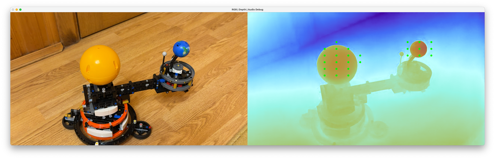

# a11y-deepsee

Hear your surroundings with computer vision and depth spatial audio. This _experimental_ Python application captures live video from the built-in camera on macOS (Apple Silicon), estimates depth with Depth Anything V2 and converts the depth map into spatialised 3d audio in real-time.

Read more in [this blog post](https://medium.com/@jan.mittelman/seeing-with-your-ear-a-humble-experiment-in-ai-depth-and-spatial-sound-08271701f336).


Left: Live camera feed  | Right: AI-generated depth map  | Green dots: Active audio sources in the 3D soundscape

## Features

- Live camera feed → depth map using state-of-the-art Depth Anything V2 (runs on Apple M-series GPU).
- **True 3-D spatial audio** via OpenAL (default) – objects are positioned in 3-D space (x/y from image, z from depth; nearer ⇒ louder).
- Modular architecture:
  - `DepthProvider` – swap the depth model.
  - `DepthToAudioMapper` – implement your own mapping from depth to audio sources.
  - `AudioOutput` – replace the audio back-end or use more sophisticated HRTF renderers.
- Simple OpenCV UI that shows:
  - raw RGB feed
  - colour-coded depth map
  - green dot matrix that indicates where the audio source is panned
- Runs locally (no internet connection once the model checkpoint has been downloaded the first time).

> NOTE The default OpenAL backend already renders a basic 3-D scene. You can plug in an even more advanced HRTF renderer by implementing a custom `AudioOutput` (e.g. using `pyroomacoustics`).

## Installation

1. Install Python 3.10 + (easiest via [Homebrew](https://brew.sh/))

   ```bash
   brew install python
   ```

2. Create and activate a virtual environment (optional but recommended):

   ```bash
   python3 -m venv .venv
   source .venv/bin/activate
   ```

3. Install the dependencies:

   ```bash
   pip install -r requirements.txt

   # install OpenAL Soft (macOS):
   brew install openal-soft

   # Add OpenAL Soft to the library path
   # current terminal session only
   export DYLD_FALLBACK_LIBRARY_PATH="/opt/homebrew/opt/openal-soft/lib"

   # or permanently (zsh default on macOS):
   echo 'export DYLD_FALLBACK_LIBRARY_PATH="/opt/homebrew/opt/openal-soft/lib:$DYLD_FALLBACK_LIBRARY_PATH"' >> ~/.zprofile
   # or (bash):
   echo 'export DYLD_FALLBACK_LIBRARY_PATH="/opt/homebrew/opt/openal-soft/lib:$DYLD_FALLBACK_LIBRARY_PATH"' >> ~/.bash_profile
   ```

   The first run will download the Depth Anything V2 checkpoint (~100 MB) from the HuggingFace Hub.

## Usage

```bash
python main.py                     # 3-D OpenAL output (default, up to 64 simultaneous voices)
python main.py --output stereo     # fallback to simple stereo panning
```

Useful flags:

- `--camera 1` use external camera with index 1
- `--device cpu` force CPU inference (slow)
- `--output stereo|3d` choose audio backend

## Customising the Mapping

`audio_mapper/simple_mapper.py` and `audio_mapper/true3d_mapper.py` expose several knobs:

- `inverse` – Set to _True_ if the depth map is _inverse_ (larger = closer, default). \
  For _metric_ depth (smaller = closer) such as the `Depth-Anything-V2-Metric-*` checkpoints, set it to _False_.
- `grid_size` – resolution of the grid that is sampled
- `min_depth` / `max_depth` – depth range in metres that should produce sound
- `base_freq` / `freq_span` – frequency range (Hz)

Feel free to subclass `DepthToAudioMapper` to implement alternative sonifications (e.g. different waveforms, MIDI output, per-pixel granular synthesis, etc.).

## Project Structure

```
depth_spatial_audio/
├── audio_mapper/
│   ├── base.py
│   ├── simple_mapper.py
├── audio_output/
│   ├── base.py
│   ├── stereo_output.py
│   ├── openal_output.py
├── depth_providers/
│   ├── base.py
│   ├── depth_anything_v2.py
├── main.py
├── requirements.txt
└── README.md
```

## Requirements & Tested Environment

- macOS 15.5 Sequoia on **Apple M1**
- Python 3.11
- PyTorch 2.3.0 (Metal / MPS backend)
- OpenCV 4.10.0
- openal-py ≥ 1.1.0 + system OpenAL Soft
- sounddevice 0.4.6 (only used with `--output stereo`)

Other Apple Silicon models should work. Intel Macs are untested. Windows / Linux users will need to swap the audio backend and maybe adjust the camera index.

## Running Tests

This project uses [pytest](https://pytest.org/) for unit testing.

Install the test dependency (inside your activated virtual environment):

```bash
pip install -r requirements.txt
pip install pytest
```

Run the suite from the repository root:

```bash
pytest
```

---

## 🤝 Contributing

Have fun exploring your surroundings _by ear_! PRs improving the depth-to-audio mapping or adding proper sounds are very welcome. Just open an issue or submit a pull request.

## 📜 License

MIT — use freely, modify openly, and share widely. See the LICENSE file for details.

---

© 2025 — Jan Mittelman
